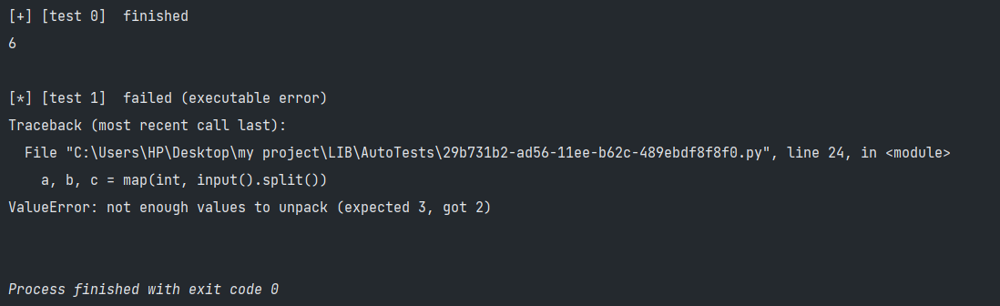
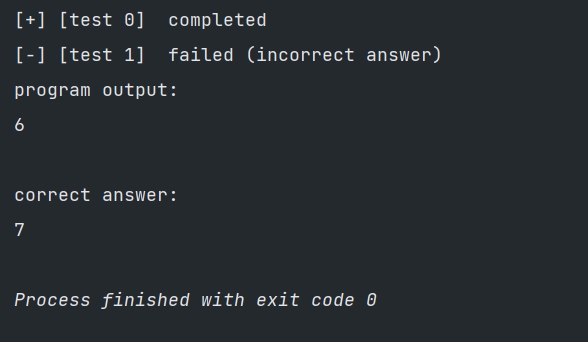

<h1> Auto Tests </h1> 
<h2> Данная библиотека позволяет задавать тесты для консольных программ, что освобождает от ручного ввода </h2>

***

<h2>Установка</h2>

    pip install auto-tests

***


<h2> Использование </h2>

Библиотека предоставляет одну функцию для использования - ```set_tests()```

Первыми аргументами передается неограниченное количество тестов. После опционально можно передать флаги для дополнительного функционала

Каждый переданный тест или ответ должен соответствовать одному из форматов ниже, при этом разные тесты могут иметь разные форматы

### Форматы

❗ **важно** ❗

Тесты считываются построчно, это означает что каждый вызов ```input()``` в вашем коде будет получать следующую строку из переданного теста

Например, если тест выглядит так: 
```python
"""
input1
input2
"""
```
то программа:
```python
inp1 = input()
inp2 = input()

print(inp1, inp2)
```
Выведет: ```input1 input2```


|          Название           | Тип данных  |                                                                                                                        Описание                                                                                                                        | 
|:---------------------------:|:-----------:|:------------------------------------------------------------------------------------------------------------------------------------------------------------------------------------------------------------------------------------------------------:|
|           строка            |     str     |                    В данном формате передается строка в тройных кавычках, где на каждой строке записана следующая строка теста. Так же можно использовать обычные строки, в таком случае разделителем между строками теста будет \n                    |
|           список            |    tuple    |                                                                                 В данном формате передается картеж из строк, где каждый элемент является строкой теста                                                                                 |
|            файл             |     str     |                                                                     В данном формате передается строка, вида "file:filename.txt", где filename.txt - файл, в котором записан тест                                                                      |


<h3> Тесты без ответов </h3>

Тесты без ответов передаются как отдельные аргументы и каждый из них должен соответствовать [одному из форматов](#форматы)

При выполнении данных тестов библиотека напечатает вывод вашей программы, а в случае возникновения ошибок выведет их 

<h5> Пример </h5>

```python
from auto_tests import *

set_tests(
    "1 2 3",  # correct test
    "1 2"     # incorrect test
)

a, b, c = map(int, input().split())
print(a + b + c)
```

#### Вывод:



<h3> Тесты с ответами </h3>

Тест с ответом задается как словарь, где ключ - тест в [одном из форматов](#форматы) и значение - ответ на тест, также в [одном из форматов](#форматы)

Тесты с ответами работают аналогично тестам без ответов, однако сравниваю результат работы программы с заданным ответом

В случае если результат и ответ совпадают, будет выведена только надпись об удачном завершении

Если вывод программы не совпал с заданным ответом, будет выведено сообщение, а также вывод программы

<h5> Пример </h5>

```python
from auto_tests import *

set_tests(
    {"1 2 3": "6"},  # correct test
    {"1 2 3": "7"}   # incorrect test
)

a, b, c = map(int, input().split())
print(a + b + c)
```

#### Вывод:



<h3> Дополнительные флаги </h3>

На данный момент существует только один флаг - ```add_timer: bool = False```

Данный флаг добавляет к выводу программы время выполнения каждого теста. По умолчанию выключено

